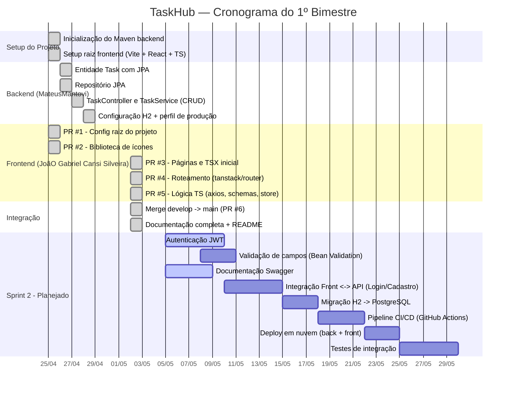

# Cronograma — Diagrama de Gantt

> Cronograma do projeto **TaskHub / Instituto-Integracao** ajustado às datas reais
> dos commits e Pull Requests evidenciados no repositório.
> Período de execução verificado: **25/abr/2026 → 02/mai/2026** (Sprint 1 — 1º bimestre).
> Período planejado: **25/abr/2026 → 31/mai/2026** (Sprints 1 e 2).

---

## Visão geral em formato Mermaid

---

## Cronograma textual por sprint

### Sprint 1 — Concluída (25/abr → 02/mai)

| Semana | Período | Atividade | Branch / PR | Status |
|--------|---------|-----------|-------------|--------|
| 1 | 25/abr | Inicialização do esqueleto Maven (backend) | `main` (`b9754f2`) | ✅ |
| 1 | 25/abr | Setup raiz do frontend (Vite/React/TS) | PR #1 | ✅ |
| 1 | 25/abr | Adição da biblioteca de ícones | PR #2 | ✅ |
| 1 | 26-28/abr | Entidade Task + Repositório JPA | `feature/entidade-task`, `feature/repositorio-task` | ✅ |
| 1 | 27-28/abr | TaskController + TaskService (CRUD REST) | `feature/controller-task` | ✅ |
| 1 | 28/abr | Configuração H2 e perfil de produção | `feature/configuracao-banco` | ✅ |
| 1 | 02/mai | Páginas e arquivos TSX iniciais | PR #3 | ✅ |
| 1 | 02/mai | Roteamento com `@tanstack/react-router` | PR #4 | ✅ |
| 1 | 02/mai | Lógica TS (Axios, schemas Zod, stores) | PR #5 | ✅ |
| 1 | 02/mai | Merge `develop` → `main` (release inicial) | PR #6 | ✅ |
| 1 | 02/mai | Documentação completa + README | `9ea648e` | ✅ |

### Sprint 2 — Planejada (05/mai → 31/mai)

| Semana | Período | Atividade | Responsável | Status |
|--------|---------|-----------|-------------|--------|
| 2 | 05-09/mai | Autenticação JWT (login/registro/token) | Backend | 🟡 A iniciar |
| 2 | 05-08/mai | Documentação Swagger/OpenAPI | Backend | 🔵 Em execução |
| 2 | 08-10/mai | Validação com Bean Validation | Backend | ⚪ A fazer |
| 3 | 10-14/mai | Integração frontend ↔ API (Login/Cadastro) | Frontend | ⚪ A fazer |
| 3 | 15-17/mai | Migração H2 → PostgreSQL | Backend | ⚪ A fazer |
| 4 | 18-21/mai | Pipeline CI/CD (GitHub Actions) | DevOps | ⚪ A fazer |
| 4 | 22-24/mai | Deploy em nuvem (Render/Vercel) | DevOps | ⚪ A fazer |
| 4 | 25-29/mai | Testes de integração + ajustes finais | Toda a equipe | ⚪ A fazer |

---

## Marcos (Milestones)

- 🏁 **M1 — 28/abr/2026** — Backend CRUD funcional com H2. ✅
- 🏁 **M2 — 02/mai/2026** — Frontend navegável com todas as páginas + merge `develop` → `main`. ✅
- 🏁 **M3 — 09/mai/2026** — Autenticação JWT integrada e Swagger publicado. 🟡
- 🏁 **M4 — 17/mai/2026** — Migração para PostgreSQL e ambiente de produção configurado. ⚪
- 🏁 **M5 — 31/mai/2026** — Deploy em nuvem com CI/CD ativo. ⚪

---

## Legenda

| Símbolo | Significado |
|---------|-------------|
| ✅ | Concluído (com evidência no Git) |
| 🔵 | Em execução |
| 🟡 | Próximo a iniciar |
| ⚪ | Planejado |
